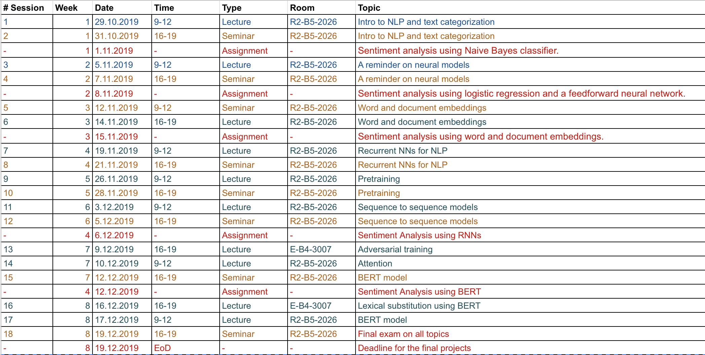

# About
SkolTech course

The course is about neural models for natural language processing. The course covers the basics and the details of successful models and methods for natural language processing based on neural networks, starting from the simple word embedding models, such as word2vec, all the way to more sophisticated language models, such ELMo and BERT. Besides, the course contains a small introduction to basic NLP methods. The course involves a substantial practical component with a number of practical assignments.

# Shedule

  

# Project 
The project was aimed at the implementation of the one-document summarization and compare different methods.
(In order to get results, like in a Project_Summarization.ipynb, you should Run All cells. If you have any problems, please contact me)
